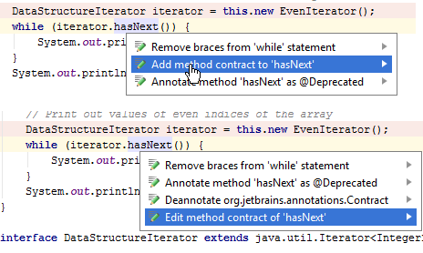
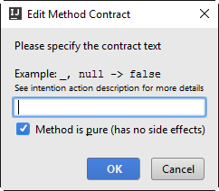

# @Contract Annotations

## 简介

`@Contract`注解通过定义方法参数和返回值之间的关系，为您的代码带来更强的安全性。此关系信息为代码提供更智能的流分析，有助于避免潜在的错误。

`@Contract`注解是一个强大而灵活的工具，可让您的API更安全。此外，使用它不仅可以用于注解您自己的代码，而且还可以用于其他现有的库。

一旦在项目库配置了注解，IntelliJ IDEA就会将有关注解的信息存储在简单的XML文件中，以便使用版本控制与团队共享。

以下示例表明了`@Contract`注解的用法：

- `@Contract("_, null -> null")`：若第二个参数为`null`，方法则返回`null`。
- `@Contract("_, null -> null; _, !null -> !null")`：若第二个参数为`null`，方法则返回`null`；否则返回not-null。
- `@Contract("true -> fail")`：典型示例是`assertFalse()`方法，如果参数为`true`则抛异常。

若想了解更多`@Contract`，请查看[Javadoc](http://javadox.com/org.jetbrains/annotations/13.0/org/jetbrains/annotations/Contract.html)。

## @Contract注解语法

`@Contract`注解有以下语法：

- `contract ::= (clause ';')* clause`
- `clause ::= args '->' effect`
- `args ::= ((arg ',')* arg)?`
- `arg ::= value-constraint`
- `value-constraint ::= '_' | 'null' | '!null' | 'false' | 'true'`
- `effect ::= value-constraint | 'fail'`

常量（constraints）的具体含义：

- `_`：任何值
- `null`：null值
- `!null`：可以静态证明的非null值
- `true`：true布尔值
- `false`：false布尔值
- `fail`：若参数满足约束条件，方法则抛出异常

## @Contract注解属性

`@Contract`注解有两个属性：`value`和`pure`。

`value`属性是设置调用参数和返回值之间关系的契约语句。

`pure`属性的设置是表示方法不会更改对象的状态而只是返回新值（即没有副作用）。此属性可用作于“Result of method call ignored”的帮助提示，以指示调用时应使用方法的返回值。默认下它的值是`false`，您可以设置为`true`。

## 示例

分析以下示例：

```java
private static void printSorted() {
  List<Integer> sorted = Quicksort.sort(null);
  if (sorted != null) {
    System.out.println("Sorted array" + sorted);
  }
}

public static <T extends Comparable<T>> List<T> sort(List<T> list) {
  if (list != null) {
    List<T> copy = new ArrayList<T>(list);
    sort(copy);
    return copy;
  } else {
    return null;
  }
}
```

IntelliJ IDEA不会出现提示，因为它不知道null输入会产生null输出。

让我们使用`@Contract`注解来装饰`sort()`方法，指定null输入产生null输出。

```java
@Contract("null -> null")
public static <T extends Comparable<T>> List<T> sort(List<T> list) {
  if (list != null) {
    List<T> copy = new ArrayList<T>(list);
    sort(copy);
    return copy;
  } else {
    return null;
  }
}
```

IntelliJ IDEA会立即识别`if`语句是无用的，会提示这个条件永远为`false`：


## 帮助提示

IntelliJ IDEA建议对类库里的方法进行以下操作：

- **添加方法契约**/**编辑方法契约**：

  

- 这两个操作都有可能设置`pure = true`：

  
