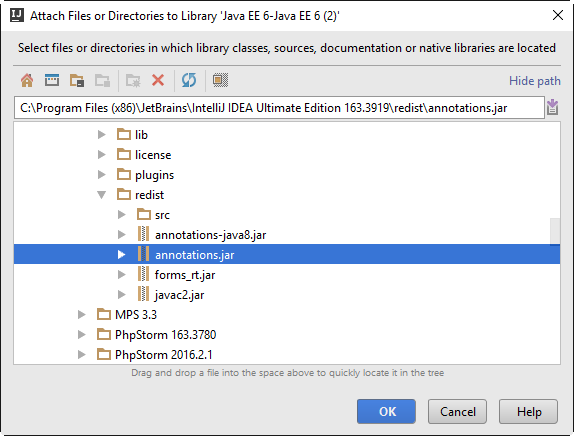
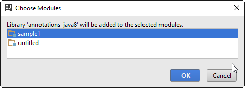
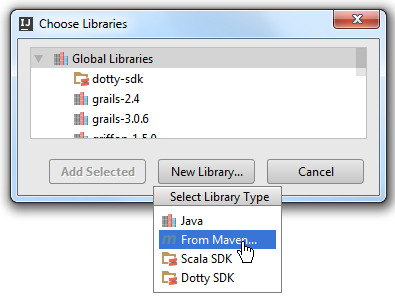
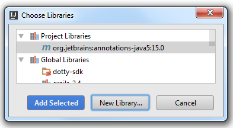
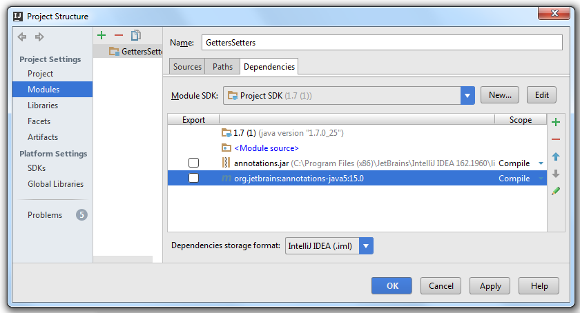
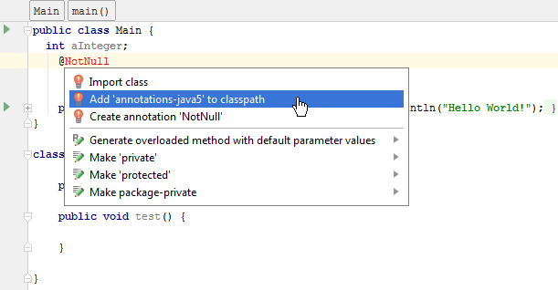

# Enabling Annotations 引入jetbrains annotations

IntelliJ IDEA允许您通过工程的本地引入，或通过Gradle或Maven依赖管理引入，抑或通过编辑界面引入annotations包，来启用注解。

## 通过本地工程引入

按以下步骤进行启用注解：

1. 点击，打开[Project Structure](https://www.jetbrains.com/help/idea/2016.3/accessing-project-structure.html)设置。

2. 在 **Project Structure** 设置界面里，点击“[Libraries](https://www.jetbrains.com/help/idea/2016.3/libraries-and-global-libraries.html)”。

3. 点击，打开[Select Library Files](https://www.jetbrains.com/help/idea/2016.3/select-path-dialog.html)设置。

4. 在您的IntelliJ IDEA安装目录下，选择`redist/annotation.jar`或者`redist/annotation-java8.jar`，点击 **OK**。

  

5. 如果项目包含多个模块，请选择所需模块，然后单击 **OK**：

  

6. 这样就把annotations包加入到类路径里了：

  

## 通过Gradle或Maven依赖管理引入

在Gradle或Maven项目里启用注解，按以下步骤：

1. 点击，打开[Project Structure](https://www.jetbrains.com/help/idea/2016.3/accessing-project-structure.html)设置。

2. 在 **Project Structure** 设置界面里，在[Modules](https://www.jetbrains.com/help/idea/2016.3/module-page.html)界面里，点击 **Dependencies** tab。

3. 在 **Dependencies** tab里，点击，从下拉列表里，选择 **Library**。

4. 在 **Choose Library** 界面里, 点击 **New Library**，在下拉列表里，选择 **From Maven**。

  

5. 在 **Download Library From Maven Repository** 界面里，输入`org.jetbrains:annotations:15.0`该包支持Java 8，抑或`org.jetbrains:annotations-java5:15.0`该包兼容Java 5，然后点击 **OK**。

  

6. 在 **Choose Libraries** 界面里，点击 **Add Selected**。

  

  这样就把annotations包加入到项目依赖里了。

  

## 通过编辑界面引入

在编辑界面里引入：

在编辑界面，输入`@NotNull`，然后按`Alt+Enter`：

那么，所选择的JAR包就会被引入：

注意，如果项目是从Maven管理的，IntelliJ IDEA会将依赖项添加到`pom.xml`中。
