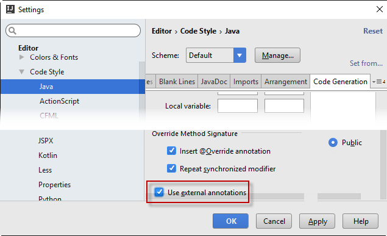

# Using External Annotations

## 简介

如果希望IntelliJ IDEA使用外部注解，则必须启用此功能，并指定存储外部注解的目录。

本节介绍：

- 启用外部注解。
- 在SDK或模块层面配置外部注解的路径。
- 应用外部注解。

## 启用外部注解

1. 在Java code style界面的Code Generation部分中，选中 **Use external annotations** 复选框。

  

2. 点击 **Apply** 或 **OK**。

## 在SDK层面定义外部注解的路径

1. 打开Project Structure界面（Ctrl+Shift+Alt+S）。

2. 在 **Platform Settings** 里，点击 **SDK**。

3. 在SDK界面里，选择 **Annotations** tab。

4. 点击 **Add** 按钮，并在Select Path对话框中指定所需的路径。您可以根据需要创建任意数量的注解路径。

5. 点击 **Apply** 或 **OK**。

## 在模块层面定义外部注解的路径

1. 在项目的右击菜单中，选择 **Open Module Settings**。Project Structure界面里选择Modules。

2. 选择 **Paths** tab。

3. 在 **External Annotations** 部分中，点击 **Add**，然后在Select Path对话框中指定所需的路径。您可以根据需要创建任意数量的注解路径。

4. 点击 **Apply** 或 **OK**。

## 使用外部注解标注符号

按以下步骤执行：

1. 如果代码检查警告您注解符号的必要性，请按（Alt+Enter）显示意向操作列表，然后选择适当的 **Annotate** 命令，例如：

  

2. 在打开的对话框里，点击 **Add externally** 按钮。

  
